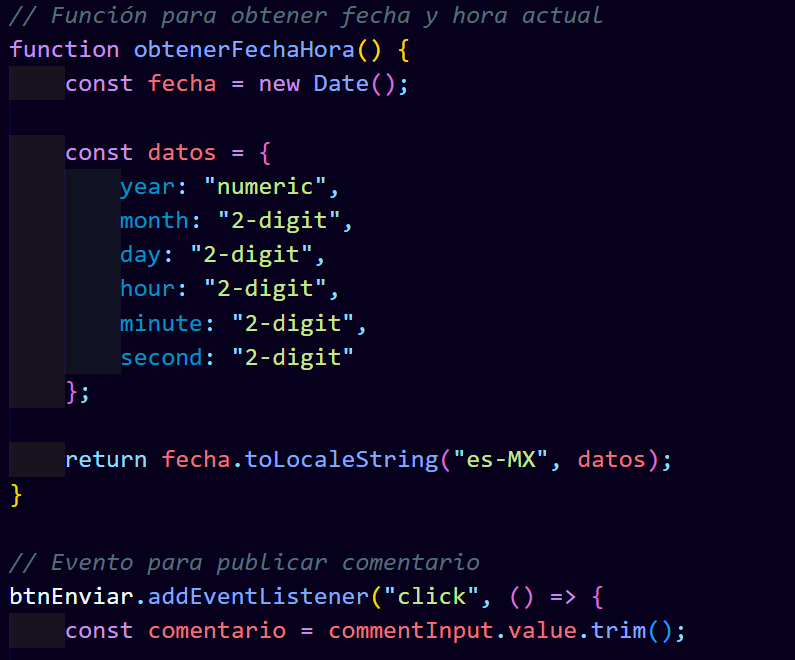
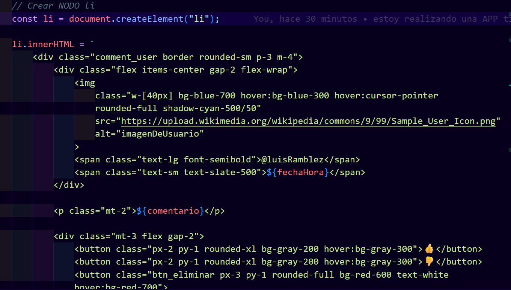
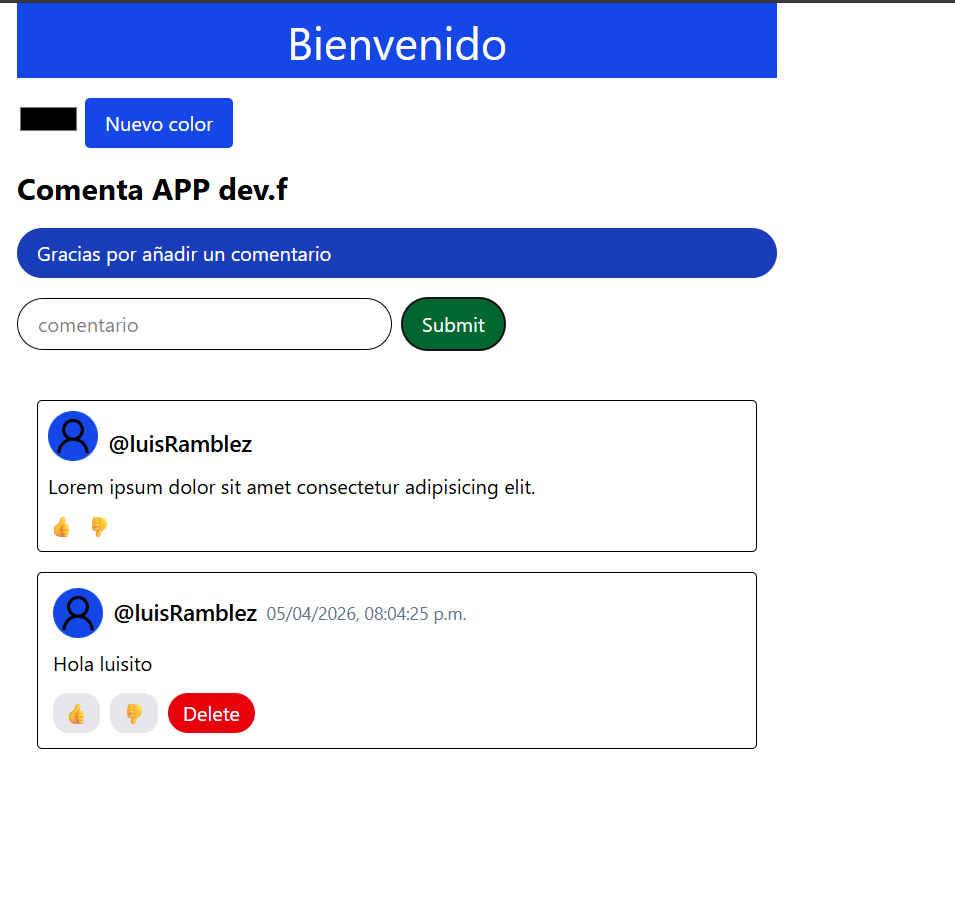
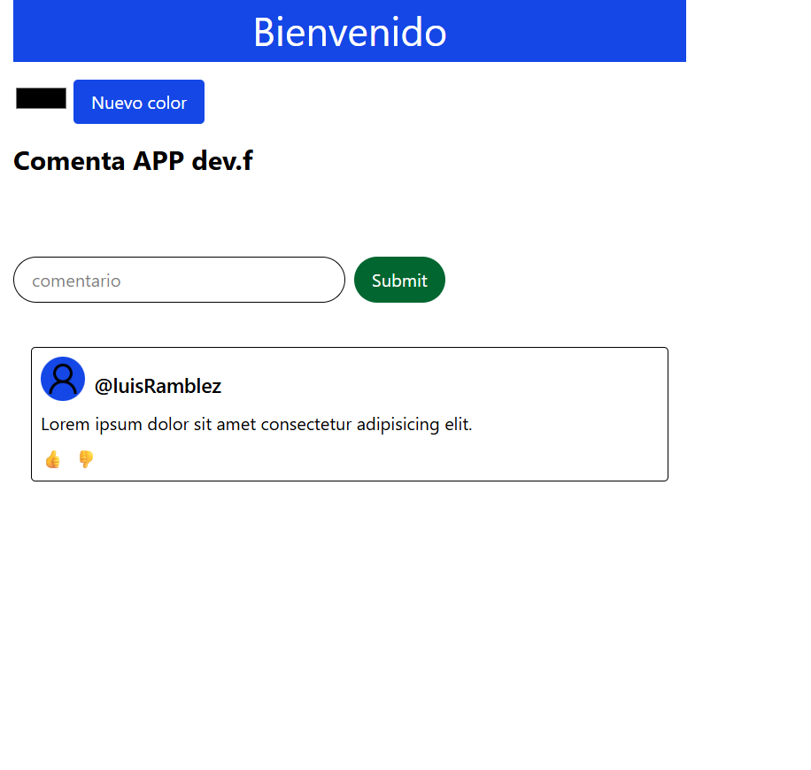
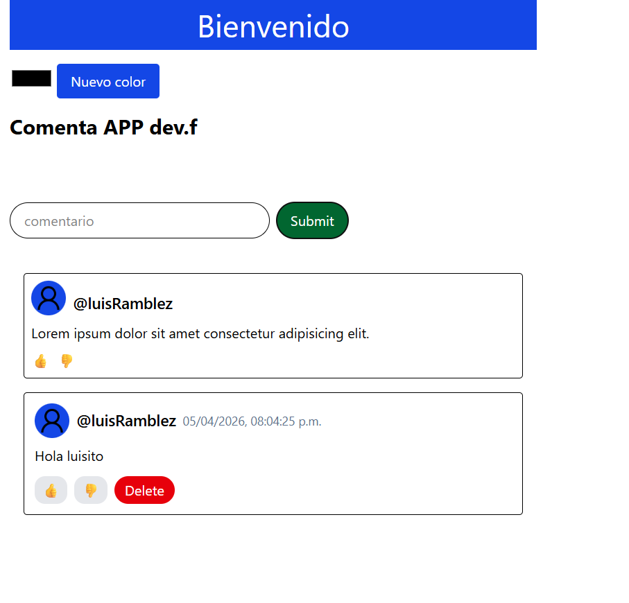

# Esta es mi APP 

# Investigue y tenia que agregar datos en lista como son año, segundo, minuto, dia, mes, y mandar a llamar a la variable en el codigo de HTML que se agrego en JS y va antes de comentarios para que quede bonito y no en linea

# Aqui muestro como se agrega el comentario

# En esta imagen muestro como al dar clic en Delete se quita el comentario

# Muestra de como queda por 3 segundos la leyenda de "Gracias por Comentar"
